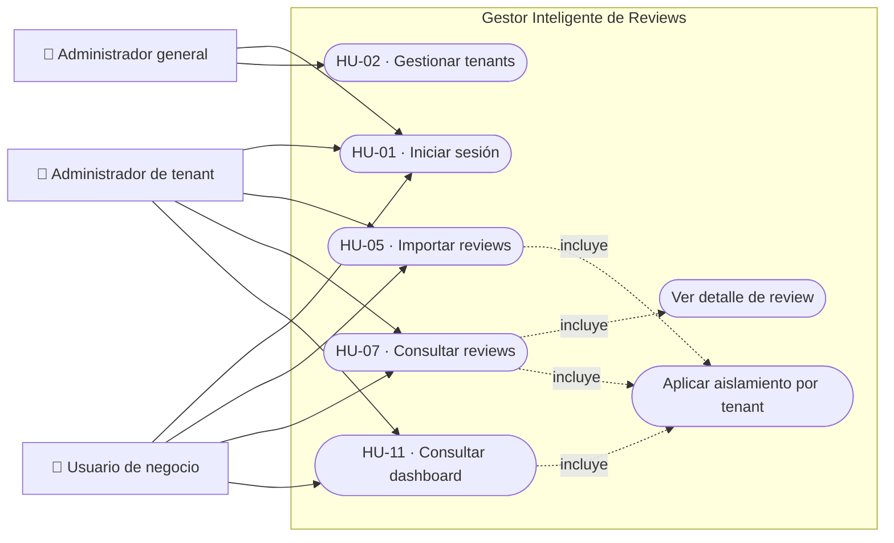

# Casos de uso del Sprint 0

El diagrama representa las historias seleccionadas para el Sprint 0. Indica alcance funcional, no que todas las historias estén terminadas o integradas en `main`.

## Límites del Sprint 0

- Incluye la arquitectura base, autenticación, tenants, importación inicial, consulta de reviews y dashboard básico.
- Excluye el procesamiento real con inteligencia artificial, integraciones con plataformas externas, notificaciones y reportes avanzados.
